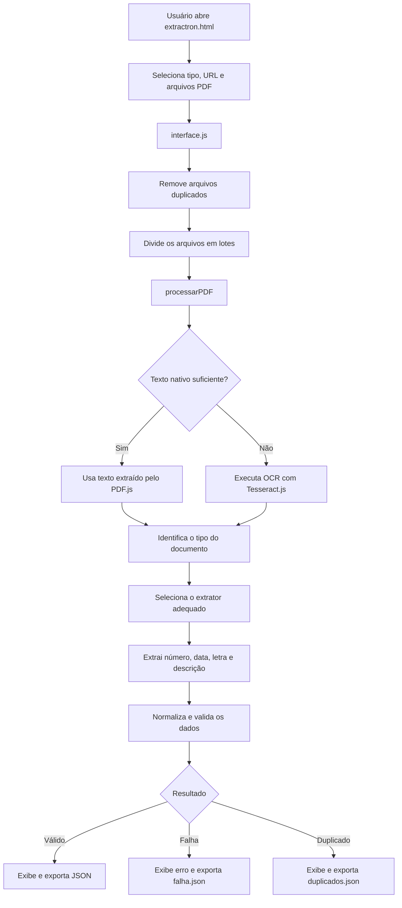

# Extractron

Sistema web para extração automatizada de informações em documentos PDF. O Extractron foi desenvolvido para auxiliar o processamento de documentos administrativos e atos oficiais, convertendo dados não estruturados em informações organizadas no formato JSON.

## Objetivo

O sistema reduz o trabalho manual de leitura e digitação de documentos. Ele identifica informações relevantes, como número, ano, data, letra identificadora e descrição, de acordo com o tipo de documento processado.

## Funcionalidades

- Processamento de vários arquivos PDF em lotes;
- Interface com seleção de arquivos e recurso de arrastar e soltar;
- Extração de texto nativo de PDFs;
- OCR para documentos digitalizados;
- Identificação automática do tipo de documento;
- Extratores específicos para decretos, leis, portarias, projetos de lei e outros documentos administrativos;
- Normalização de textos, datas e nomes de arquivos;
- Validação dos campos obrigatórios;
- Indicadores de progresso, arquivos processados, pendentes e com erro;
- Exportação dos dados extraídos em arquivos JSON;
- Processamento local no navegador, sem necessidade de servidor próprio.

## Como utilizar

1. Abra o arquivo `extractron.html` em um navegador moderno.
2. Selecione os tipos de documentos que serão processados.
3. Arraste os arquivos PDF para a área indicada ou clique para selecioná-los.
4. Configure, se necessário, a quantidade de arquivos processados por lote.
5. Aguarde o término da extração.
6. Baixe o arquivo JSON com os dados estruturados.

## Fluxo de processamento

```text
PDF → Leitura de texto ou OCR → Identificação do documento
    → Extração dos campos → Normalização e validação → JSON
```

Quando o PDF possui texto selecionável, o sistema utiliza a extração nativa. Caso o documento seja digitalizado, o Extractron utiliza OCR para reconhecer os caracteres presentes nas páginas.

## Mapa de funcionamento

O processamento começa no navegador e permanece no ambiente local. O usuário fornece os PDFs, e o sistema percorre cada arquivo em lotes, identifica o tipo documental, extrai os campos e disponibiliza os resultados para download.



### Rota de uma requisição de processamento

```text
extractron.html
  → interface.js
  → processarArquivosEmLotes()
  → processarPDF()
  → PDF.js ou Tesseract.js
  → extrairInformacoes()
  → extrator específico
  → validarDocumentos()
  → downloadArquivos()
  → informações_extraidos.json / falha.json / duplicados.json
```

O fluxo não depende de servidor de aplicação: as bibliotecas são carregadas por CDN, os PDFs são lidos pela File API do navegador e os arquivos JSON são gerados localmente.

## Tipos de documentos

O catálogo do sistema pode incluir diferentes tipos documentais, entre eles:

- Decretos;
- Leis;
- Portarias;
- Projetos de lei;
- Resoluções;
- Requerimentos;
- Ofícios;
- Declarações;
- Atas;
- Diários oficiais;
- Documentos administrativos e outros tipos configurados no sistema.

## Exemplo de saída

```json
{
  "numero": "001/2024",
  "data": "01/01/2024",
  "letra": "A",
  "descricao": "Dispõe sobre a organização administrativa",
  "arquivo": "decreto_001_2024.pdf"
}
```

Os campos podem variar conforme o tipo de documento selecionado e as regras de extração configuradas.

## Tecnologias utilizadas

- HTML5, CSS e JavaScript;
- PDF.js, para leitura de arquivos PDF;
- Tesseract.js, para reconhecimento óptico de caracteres (OCR);
- HTML5 File API, para manipulação local dos arquivos;
- JSON, para organização e exportação dos dados.

As bibliotecas principais são carregadas por CDN, portanto o projeto não exige instalação de dependências para ser executado no navegador.

## Estrutura do projeto

```text
extractron.html                    Interface principal
js/interface.js                    Controle da interface
js/tiposDeDocumentos.js            Catálogo de tipos documentais
js/extractron/processamento/       Normalização e validação dos dados
js/extractron/leitura/             Leitura de PDF e acionamento do OCR
js/extractron/extratores/          Regras específicas por tipo de documento
js/extractron/controle/            Coordenação do processo de extração
```

## Integração com outros sistemas

O JSON gerado pode ser consumido por outros sistemas, como o FORMTRON, permitindo automatizar o preenchimento de formulários e a inserção dos dados em plataformas web.

```text
PDF → Extractron → JSON → Formtron → Sistema institucional
```

## Aplicação como tema de TCC

O Extractron pode ser utilizado como tema de Trabalho de Conclusão de Curso por envolver desenvolvimento web, processamento de documentos, OCR, automação de processos e organização de dados.

Uma sugestão de título é:

> Desenvolvimento de um sistema web para extração automatizada de informações em documentos PDF utilizando processamento de texto e OCR

O trabalho pode avaliar a precisão da extração, o tempo de processamento, o desempenho do OCR e as limitações causadas por diferentes formatos e qualidades de digitalização.

## Limitações

- O OCR pode exigir mais tempo de processamento, especialmente em documentos com muitas páginas.
- A qualidade da digitalização influencia diretamente a precisão do reconhecimento.
- Documentos com layouts muito diferentes podem exigir novas regras de extração.
- O processamento local depende da memória e do desempenho do navegador.
- Arquivos que ultrapassarem os limites de processamento podem ser encaminhados para um arquivo de falhas.

## Compatibilidade

O Extractron foi planejado para navegadores modernos, como:

- Google Chrome e Microsoft Edge;
- Mozilla Firefox;
- Safari.

## Licença

Nenhuma licença específica foi definida neste repositório. Consulte o responsável pelo projeto antes de distribuir ou reutilizar o código.
