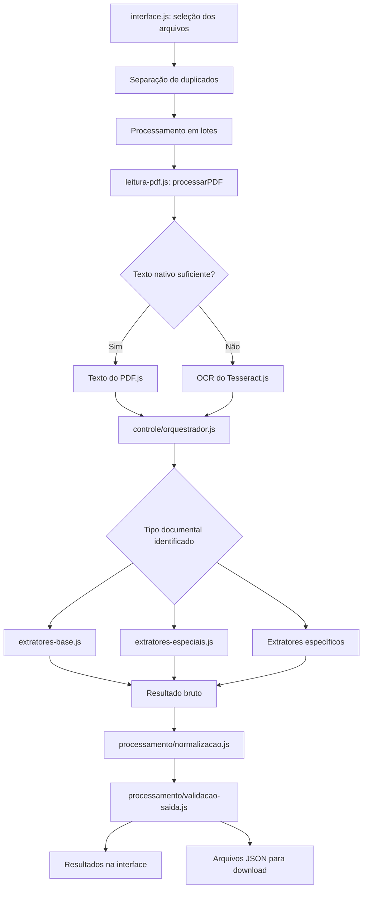
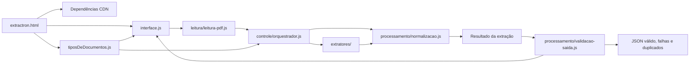

# JavaScript do Extractron

Esta pasta reúne o código JavaScript responsável pela interface, leitura dos PDFs, identificação dos documentos e extração dos dados do Extractron. Os arquivos foram separados por responsabilidade para facilitar a manutenção e a evolução do sistema.

## Estrutura

```text
js/
├── interface.js
├── tiposDeDocumentos.js
└── extractron/
    ├── controle/
    │   └── orquestrador.js
    ├── extratores/
    │   ├── extratores-administrativos.js
    │   ├── extratores-base.js
    │   ├── extratores-especiais.js
    │   ├── extrator-decreto.js
    │   ├── extrator-lei.js
    │   ├── extrator-portaria.js
    │   └── extrator-projeto-lei.js
    ├── leitura/
    │   └── leitura-pdf.js
    └── processamento/
        ├── normalizacao.js
        └── validacao-saida.js
```

## Arquivos da aplicação

### [`interface.js`](interface.js)

Controla a interface do sistema, incluindo:

- seleção e envio dos arquivos PDF;
- configuração do tamanho dos lotes;
- atualização do progresso;
- exibição de resultados e erros;
- filtros e seleção dos tipos de documento;
- interação com os campos da tela.

### [`tiposDeDocumentos.js`](tiposDeDocumentos.js)

Contém o catálogo de tipos documentais disponíveis no sistema. Cada registro pode definir o identificador, o nome, o padrão do arquivo, a existência de número, a aceitação de letra e as configurações de publicação.

O catálogo é disponibilizado globalmente em `window.tiposDeDocumentos` e utilizado pela interface e pelos extratores.

## Módulos do Extractron

### Processamento

Arquivos em [`extractron/processamento/`](extractron/processamento/):

- [`normalizacao.js`](extractron/processamento/normalizacao.js): normaliza textos, acentos, nomes de arquivos e datas; também auxilia na identificação de tipos documentais.
- [`validacao-saida.js`](extractron/processamento/validacao-saida.js): valida os campos obrigatórios, prepara os dados extraídos e gera o arquivo JSON de saída.

### Leitura

Arquivos em [`extractron/leitura/`](extractron/leitura/):

- [`leitura-pdf.js`](extractron/leitura/leitura-pdf.js): abre os PDFs com PDF.js, extrai texto nativo, aciona o OCR quando necessário e aplica limites de tempo para evitar travamentos.

### Extratores

Arquivos em [`extractron/extratores/`](extractron/extratores/):

- [`extratores-base.js`](extractron/extratores/extratores-base.js): regras para regimentos, emendas, resoluções, Diário Oficial e Projeto Político-Pedagógico (PPP).
- [`extratores-especiais.js`](extractron/extratores/extratores-especiais.js): regras para despesas genéricas, julgamento de contas, atas, números romanos e datas por extenso.
- [`extrator-projeto-lei.js`](extractron/extratores/extrator-projeto-lei.js): extrai dados de Projetos de Lei.
- [`extrator-lei.js`](extractron/extratores/extrator-lei.js): extrai dados de leis a partir do nome e do conteúdo do documento.
- [`extrator-portaria.js`](extractron/extratores/extrator-portaria.js): extrai dados de portarias.
- [`extrator-decreto.js`](extractron/extratores/extrator-decreto.js): extrai dados de decretos.
- [`extratores-administrativos.js`](extractron/extratores/extratores-administrativos.js): reúne as regras para requerimentos, ofícios e declarações.

### Controle

Arquivos em [`extractron/controle/`](extractron/controle/):

- [`orquestrador.js`](extractron/controle/orquestrador.js): coordena a extração, escolhe o extrator adequado, combina o tipo informado com o nome e o conteúdo do arquivo e faz o pós-processamento dos dados.

## Fluxo de execução

```text
PDF
  → leitura de texto nativo ou OCR
  → identificação do tipo de documento
  → aplicação do extrator correspondente
  → normalização e validação
  → geração do JSON
```

## Mapa de funcionamento



## Rota arquitetural



### Caminho entre os módulos

1. [`extractron.html`](../extractron.html) carrega PDF.js, Tesseract.js e os scripts locais.
2. [`tiposDeDocumentos.js`](tiposDeDocumentos.js) publica `window.tiposDeDocumentos`, usado na seleção e na identificação dos tipos.
3. [`interface.js`](interface.js) recebe os arquivos, valida os campos da tela, remove duplicados e controla os lotes.
4. [`leitura-pdf.js`](extractron/leitura/leitura-pdf.js) lê as páginas com PDF.js e usa OCR quando o texto nativo é insuficiente.
5. [`orquestrador.js`](extractron/controle/orquestrador.js) combina tipo selecionado, nome do arquivo, URL e conteúdo para escolher a regra de extração.
6. Os arquivos em [`extratores/`](extractron/extratores/) extraem os campos específicos de cada documento.
7. [`normalizacao.js`](extractron/processamento/normalizacao.js) padroniza textos, datas, nomes e tipos identificados.
8. [`validacao-saida.js`](extractron/processamento/validacao-saida.js) separa documentos válidos, falhos e duplicados e gera os arquivos JSON.
9. [`interface.js`](interface.js) apresenta os resultados, o progresso e as mensagens de erro ao usuário.

### Rotas de saída

```text
Resultado válido   → informações_extraidos.json
Documento com erro → falha.json
Documento duplicado → duplicados.json
```

## Ordem de carregamento

Os scripts locais são carregados pelo [`extractron.html`](../extractron.html) na seguinte ordem:

1. [`tiposDeDocumentos.js`](tiposDeDocumentos.js)
2. [`normalizacao.js`](extractron/processamento/normalizacao.js)
3. [`extratores-base.js`](extractron/extratores/extratores-base.js)
4. [`validacao-saida.js`](extractron/processamento/validacao-saida.js)
5. [`leitura-pdf.js`](extractron/leitura/leitura-pdf.js)
6. [`extratores-especiais.js`](extractron/extratores/extratores-especiais.js)
7. [`extrator-projeto-lei.js`](extractron/extratores/extrator-projeto-lei.js)
8. [`extrator-lei.js`](extractron/extratores/extrator-lei.js)
9. [`extrator-portaria.js`](extractron/extratores/extrator-portaria.js)
10. [`extrator-decreto.js`](extractron/extratores/extrator-decreto.js)
11. [`extratores-administrativos.js`](extractron/extratores/extratores-administrativos.js)
12. [`orquestrador.js`](extractron/controle/orquestrador.js)
13. [`interface.js`](interface.js)

A ordem é necessária porque os arquivos compartilham funções e objetos no escopo global do navegador. O projeto utiliza scripts tradicionais, e não módulos ES com `import` e `export`.

## Convenções para manutenção

- Regras comuns de texto, nomes e datas devem ficar em `processamento/normalizacao.js`.
- Regras específicas de um tipo documental devem ficar em `extratores/`.
- Rotinas de leitura de PDF e OCR devem ficar em `leitura/`.
- A coordenação entre leitura, identificação e extração deve ficar em `controle/orquestrador.js`.
- Ao criar ou mover um arquivo, atualize também as referências de script em [`extractron.html`](../extractron.html) e esta documentação.
